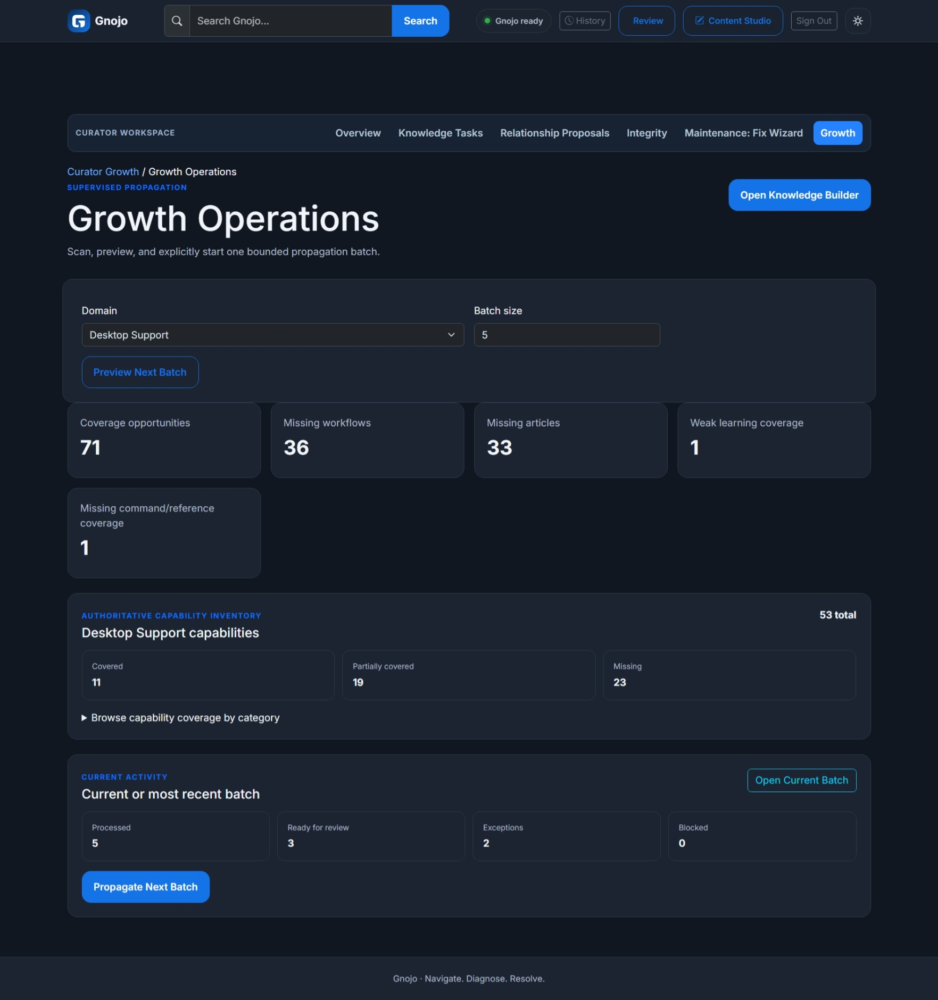
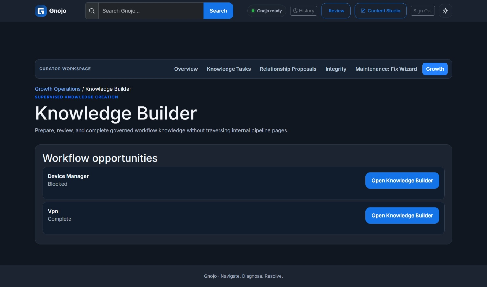
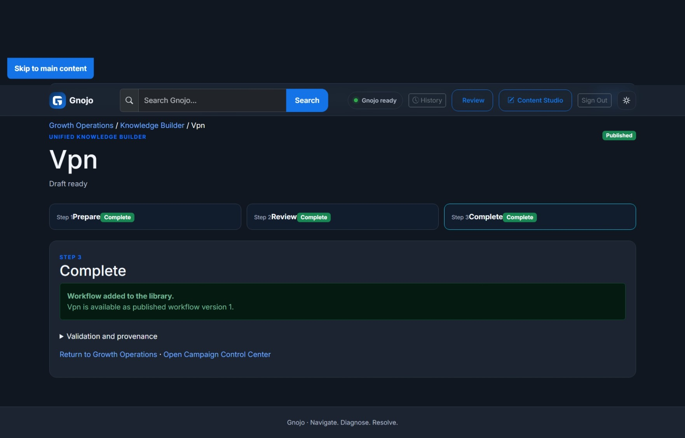
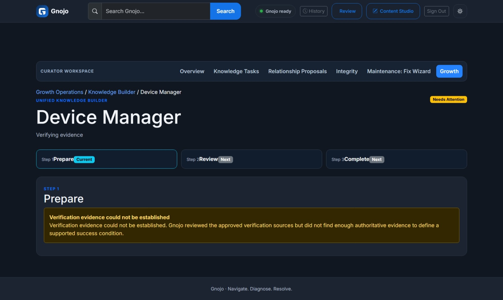

# Gnojo

**Navigate. Diagnose. Resolve.**

Gnojo is a governed, AI-assisted platform for building and operating trustworthy IT knowledge and troubleshooting workflows. It automates routine preparation while keeping source selection, consequential decisions, workflow approval, and publication under explicit human control.

The name combines **gnosis** (knowledge through understanding) and **dojo** (a place for disciplined practice and improvement). Gnojo is pronounced **NO-joe**.

## What Gnojo Does

Gnojo brings guided troubleshooting, knowledge authoring, quality review, and controlled library growth into one application. Its operator-facing Knowledge Builder turns a coverage opportunity into an evidence-backed workflow through a simple three-step experience: **Prepare → Review → Complete**.

Behind that experience, Gnojo can discover deterministic coverage gaps, coordinate supervised research, extract and classify evidence, prepare claims, generate workflow proposals, validate drafts, and present the decisions that require human judgment. Published workflows, articles, command references, and diagnostic guidance remain separate from work in progress.

Gnojo also provides a searchable troubleshooting catalog, resumable sessions, device-aware guidance, reviewed command and script libraries, content-authoring workspaces, and operational integrity tooling.

## Prepare → Review → Complete

### 1. Prepare

One supervised action advances through the machine-safe work currently available:

- research and authoritative source selection
- evidence extraction, relevance checks, and evidence-role review
- compressed review of compatible human exceptions
- claim planning and completeness checks
- workflow proposal and learning/help-text preparation
- bounded continuation until the next governed decision or external-operation boundary

Gnojo stops when source ambiguity, safety, stale state, conflicting evidence, or missing support requires human judgment. It does not manufacture evidence to keep the pipeline moving.

### 2. Review

The reviewer inspects the proposed workflow together with its sources, evidence, claims, validation results, and unresolved exceptions. Approval creates a validated, editable workflow draft; it does **not** publish the workflow.

### 3. Complete

Gnojo performs final deterministic validation and presents an explicit human **Add to Library / Publish** action. A published workflow receives a version and becomes available through the governed library lifecycle.

## Why Governance Matters

AI in Gnojo is bounded assistance, not an unrestricted chatbot or an independent publishing authority. It can help triage research sources, classify extracted evidence, prepare claims and workflows, draft learning text, and progress supervised campaigns. Humans retain authority over ambiguous or consequential decisions and final publication.

The platform protects that boundary with:

- exact campaign, work-item, source, evidence, claim, and artifact identities
- source provenance and deterministic fingerprints
- stale-state and collision checks before governed writes
- validation of workflow structure, safety, evidence support, and publication readiness
- reviewer authentication and CSRF protection for privileged decisions
- idempotent operations, locks, CAS checks, and durable history where supported
- fail-closed behavior when evidence is insufficient, conflicting, unsafe, or no longer current

Failing closed is a product outcome. In the verified Device Manager walkthrough, Gnojo exhausted the human-approved Microsoft sources without finding authoritative success-verification evidence. It reported **“Verification evidence could not be established,”** created no unsupported verification claim, and did not approve or publish a workflow.

## Application Preview

### Growth Operations



Capability coverage identifies deterministic growth opportunities, while supervised propagation and bounded batch controls keep expansion deliberate and reviewable.

### Knowledge Builder



The unified **Prepare → Review → Complete** experience keeps routine progression simple while preserving governed human decisions. VPN is Complete and Device Manager is Blocked in the same view, demonstrating both successful completion and safe refusal.

### VPN Complete



VPN passed governed preparation and review, then was explicitly added to the library as published workflow version 1.

### Device Manager: Evidence-Governed Stop



Gnojo exhausted the approved verification sources but refused to fabricate a supported success condition. This is intentional evidence-governed, fail-closed behavior—not an application error.

## Key Capabilities

- **Growth Operations:** deterministic capability coverage inventory, ranked growth opportunities, and explicitly initiated supervised propagation batches.
- **Knowledge Builder:** a unified Prepare → Review → Complete experience for governed workflow creation.
- **Campaign Control Center:** campaign state, human gates, machine-ready work, exceptions, and exact review destinations.
- **Research and evidence:** authoritative source review, canonical source deduplication, bounded retrieval, extraction, proposition consolidation, and provenance-preserving evidence review.
- **Review compression:** compatible evidence and claim decisions are summarized into governed review groups without auto-approving human exceptions.
- **Claim planning:** evidence-backed procedure and verification claims with coverage, conflict, and completeness checks.
- **Workflow generation:** inspectable workflow proposals and validated editable drafts; generation and approval remain separate from publication.
- **Troubleshooting:** searchable guided workflows, branch-aware progress, resumable sessions, feedback, history, and device profiles.
- **Knowledge library:** reviewed articles, command references, diagnostic scripts, learning content, and workflow relationships.
- **Curator, Integrity, and Fix Wizard:** deterministic quality findings, durable review tasks, operational evidence, controlled repair assistance, and integrity visibility.
- **Production data support:** one configurable persistent data root for mutable repositories while immutable application configuration remains source-relative.
- **Accessible interface:** responsive light and dark themes, keyboard support, visible focus, landmarks, and governed cross-workspace return context.

## How It Works

Gnojo separates deterministic discovery and validation from bounded AI assistance and human authority:

```mermaid
flowchart LR
    A["Coverage discovery"] --> B["Supervised campaign"]
    B --> C["Source research and review"]
    C --> D["Evidence extraction and review"]
    D --> E["Claim planning"]
    E --> F["Workflow proposal"]
    F --> G["Human draft approval"]
    G --> H["Editable validated draft"]
    H --> I["Final validation"]
    I --> J["Human publication"]
```



Growth Operations uses the current capability catalog and published library to rank supported gaps such as missing articles, weak learning coverage, missing command relationships, and missing workflows. An operator starts a bounded batch; existing campaigns and work are reused rather than duplicated.

Campaign orchestration then advances only through safe, eligible stages. External retrieval remains explicit where required, human gates stop progression, and the current authoritative artifact is revalidated before mutation. Detailed source, evidence, claim, campaign, and workflow workspaces remain available for technical inspection, while Knowledge Builder provides the normal operator path.

### Verified v1 walkthroughs

- **VPN:** traversed Prepare → Review → Complete, received explicit human workflow approval, and was explicitly published as workflow version 1.
- **Device Manager:** identified missing success-verification evidence, launched targeted recovery, retrieved human-approved Microsoft sources one operation at a time, compressed compatible evidence decisions, retained diagnostic material as Reviewer Context, and stopped without approval or publication when every approved verification source was exhausted.

## Content Lifecycle

Generated or proposed material remains separate from trusted published content:

1. Discover a supported coverage opportunity.
2. Prepare sources, evidence, claims, and an artifact proposal.
3. Resolve only the human exceptions that block safe progression.
4. Review and approve creation of an editable draft.
5. Validate the draft and explicitly publish an immutable version.
6. Use outcomes, feedback, Curator findings, and coverage analysis to guide later improvements.

Built-in and published content is not silently overwritten. Content marked `pending_review` is intentionally not represented as fully reviewed, and technical guidance should be validated in an appropriate safe environment before production use.

## Local Setup

Requirements: Python 3.11 or newer and Git.

1. Clone the repository and open its folder.
2. Create a virtual environment:

   ```powershell
   py -m venv .venv
   ```

3. Activate it and install dependencies:

   ```powershell
   .\.venv\Scripts\Activate.ps1
   python -m pip install -r requirements.txt
   ```

4. Copy `.env.example` to `.env`. Add provider API keys only for the AI-assisted capabilities you intend to use.
5. Start Gnojo:

   ```powershell
   python run.py
   ```

6. Open `http://127.0.0.1:5000` in a browser.

The Flask application can boot without either AI provider key. A provider-specific capability fails clearly when invoked without its required configuration; Gnojo does not silently substitute one provider for another.

`.env` and local runtime data are ignored by Git. Never commit API keys, saved profiles, troubleshooting histories, unpublished drafts, or operational campaign state.

## Configuration

| Variable | Purpose |
| --- | --- |
| `FLASK_SECRET_KEY` | Stable session-signing key; required for Reviewer/Admin sign-in and must be a strong private value |
| `GNOJO_REVIEWER_USERNAME` | Username for the single Reviewer/Admin identity |
| `GNOJO_REVIEWER_PASSWORD_HASH` | Werkzeug password hash for the Reviewer/Admin password; generate it with `generate_password_hash` and never store plaintext |
| `GNOJO_SESSION_COOKIE_SECURE` | Set to `true` for HTTPS deployments; leave `false` only for local HTTP development |
| `GNOJO_SESSION_LIFETIME_MINUTES` | Reviewer session lifetime in minutes; defaults to `480` |
| `GNOJO_DEBUG` | Set to `true` only for local debugging |
| `GNOJO_SESSION_ENVIRONMENT` | Classify new troubleshooting sessions as `production`, `development`, or `test`; older records remain unclassified |
| `GNOJO_DATA_ROOT` | Optional persistent root for runtime-mutable repositories; unset preserves the repository-relative local layout |
| `GEMINI_API_KEY` | Optional Gemini access |
| `GEMINI_MODEL` | Optional Gemini model override |
| `OPENAI_API_KEY` | Optional OpenAI access |
| `OPENAI_MODEL` | Optional OpenAI model override |

For a first deployment, set `GNOJO_DATA_ROOT` to an empty persistent directory, then initialize its baseline content once:

```powershell
python -m curator init-data-root
```

The initializer refuses to overwrite a populated data root. A fresh volume may contain an empty `lost+found` directory and known empty Gnojo runtime scaffolding. Initialization never runs automatically during application startup. Mutable repositories live beneath the configured data root; immutable application configuration remains in the deployed source tree.

## Validation and Development

Run the complete automated test suite before committing application changes:

```powershell
.\.venv\Scripts\python.exe -m unittest discover -s tests -p 'test_*.py'
.\.venv\Scripts\python.exe -m pip check
```

The suite covers workflows, publishing, search, device-aware routing, history, knowledge review, commands, scripts, accessibility, responsive behavior, error recovery, governance, and content integrity.

Run the Curator auditor without modifying trusted content:

```powershell
.\.venv\Scripts\python.exe -m curator audit
```

See [Gnojo Curator](docs/curator.md) for filters, outputs, exit codes, scheduling, and trust boundaries.

## Project Structure

- `app/` – Flask application, services, templates, static assets, built-in workflows, and immutable application configuration
- `knowledge_base/` – command and script libraries plus the repository-relative local knowledge layout
- `curator/` – Curator commands, governed automation entry points, and operational tooling
- `tests/` – automated application, governance, navigation, and content-integrity tests
- `docs/` – product, architecture, design, taxonomy, and brand documentation
- `run.py` – local development entry point

## Product Principles

- Guide users through evidence-backed troubleshooting instead of guessing.
- Automate routine preparation while preserving human authority over consequential decisions.
- Explain why a step matters and retain the evidence behind generated guidance.
- Prefer safe, reversible diagnostics and clearly classify state-changing work.
- Keep proposed content in review until a person approves it, and never equate draft approval with publication.
- Stop clearly when current evidence cannot support a trustworthy result.

Start with the [`docs` index](docs/README.md), then see [`docs/architecture.md`](docs/architecture.md), [`docs/brand.md`](docs/brand.md), and [`docs/roadmap.md`](docs/roadmap.md).
