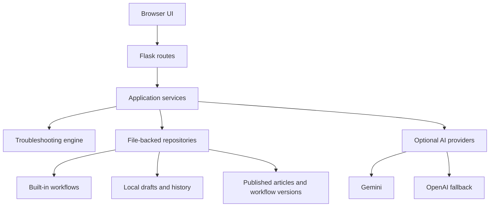
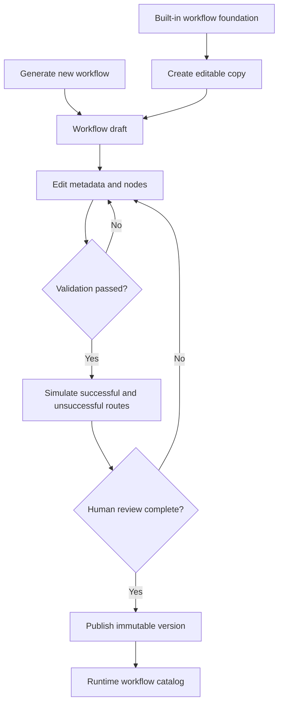
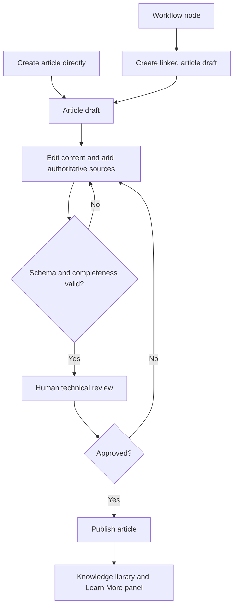

# Gnojo Architecture

## Scope

This document describes the current local-development architecture. Future product ideas belong in the roadmap or Gnojo 2.0 blueprint.

## Application shape

Gnojo is a server-rendered Flask application with progressive JavaScript enhancements.



- `run.py` starts the local Flask server.
- `app/app.py` defines routes and composes application services.
- `app/templates/` contains the page and component templates.
- `app/static/` contains styles, browser behavior, and brand assets.
- `app/services/` contains workflow, publication, search, quality, and content operations.
- `app/repositories/` provides file-backed content access.
- `app/models/` and `app/engine/` represent and run troubleshooting nodes.

## Content storage

Gnojo currently uses version-controlled JSON for trusted content and ignored local folders for mutable runtime data.

### Version-controlled content

- `app/decision_trees/`: built-in workflow foundations
- `knowledge_base/published/`: reviewed knowledge articles
- `knowledge_base/commands/`: command references
- `knowledge_base/scripts/`: reviewed scripts and script metadata

### Local runtime content

- `app/workflow_drafts/`: editable workflow drafts
- `app/workflow_publications/`: locally published workflow versions
- `knowledge_base/drafts/`: article drafts awaiting review
- `app/device_profiles/`: optional saved device context
- `app/troubleshooting_history/`: local session history and feedback

Local runtime folders are ignored by Git. Reviewed articles intentionally moved into `knowledge_base/published/` are version controlled.

## Workflow lifecycle



1. An author generates a workflow or creates an editable copy of a built-in workflow.
2. The Workflow Designer edits metadata and individual nodes.
3. Validation checks required fields, node types, destinations, reachability, and terminal paths.
4. The simulator exercises successful and unsuccessful branches with optional device conditions.
5. Publication creates an immutable numbered version for the runtime catalog.
6. Runtime sessions can be resumed, recorded in history, and summarized in quality analytics.

Built-in workflow JSON is preserved as a foundation. Editing and publication occur through separate draft and publication files.

## Knowledge lifecycle



1. An article can be created directly or generated from a workflow node.
2. Draft content is edited in the Knowledge Review Workspace.
3. Validation checks the article schema and required fields.
4. A human reviewer verifies technical claims, safety, sources, commands, and risks.
5. Approved content is published to the knowledge library.
6. Workflow nodes reference published articles by stable article ID.

Generated content is never treated as reviewed solely because it passed structural validation.

## AI providers

AI support is optional. Gemini is the primary configured provider and OpenAI is the fallback for supported generation tasks. Provider output is normalized into Gnojo schemas and must pass validation before review.

When no provider is configured or a provider fails, supported features use local fallbacks where practical. API keys are loaded from environment variables and must never be committed.

## Safety and trust boundaries

- AI creates drafts; people approve publication.
- Official vendor documentation is preferred for technical claims.
- Risk, permissions, and service impact must be explicit.
- Device profiles and troubleshooting history remain local by default.
- Published content is separated from editable drafts.
- Workflow simulation is a logic test; it does not execute diagnostic commands on the host.

## Testing

The `tests/` directory uses Python's built-in `unittest` runner. The suite covers application pages, content integrity, workflow editing and publication, article review, commands, scripts, search, accessibility, device-aware routing, recovery behavior, and quality analytics.

Run the full suite with:

```powershell
.\.venv\Scripts\python.exe -m unittest discover -s tests -p 'test_*.py'
.\.venv\Scripts\python.exe -m pip check
```

## Deployment status

The current entry point uses Flask's development server for local work. `gunicorn` is included for a future hosted deployment. Production hosting still requires an explicit deployment configuration, persistent-storage decision, environment-secret configuration, and security review.
